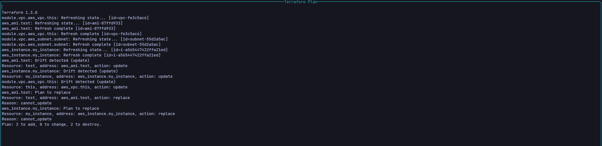
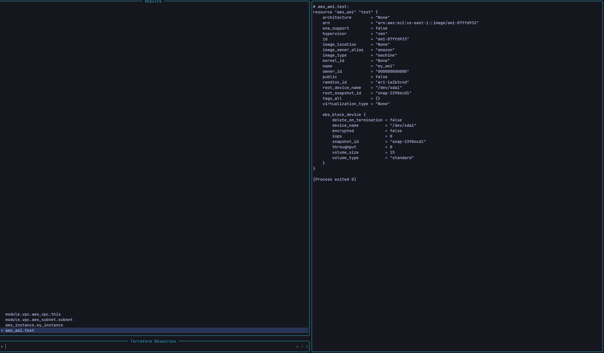

# Overview

If you do a lot of terraform manifests, and you would like to see quickly the current state of your objects or how the plan would look like, this plugin is for you.

# Requirements

- [ Terraform ](https://developer.hashicorp.com/terraform/downloads)
- [ Plenary ](https://github.com/nvim-lua/plenary.nvim)
- [ Telescope ](https://github.com/nvim-telescope/telescope.nvim)
- [ Nui ](https://github.com/MunifTanjim/nui.nvim)

# Usage

It currently supports 2 commands:

- `TerraformPlan` => Will run a plan and show the overall information on a pop-up window

- `TerraformExplore` => Will inspect your terraform state and open up a telescope window with a list of all your resources.
  

      - Currently selected resource will show a preview of the resource according to the state, useful to get a quick glance for things like VPCs, Security Groups, etc.
      

      - Selecting an item will take you to the resource selected in the right line and file
      

# Contributing

Open to suggestions and enhancements

# License

See [LICENSE](LICENSE)
