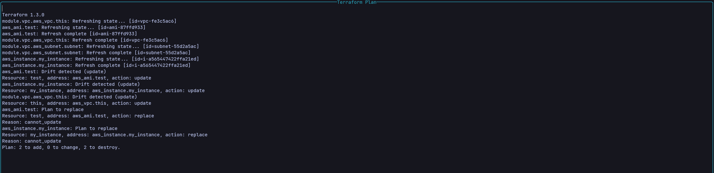
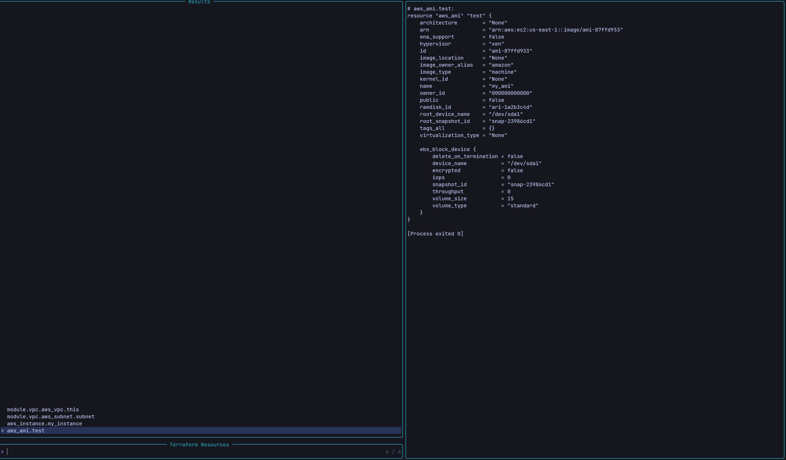

# Overview

If you do a lot of terraform manifests, and you would like to see quickly the current state of your objects or how the plan would look like, this plugin is for you.

# Requirements

- [ Terraform ](https://developer.hashicorp.com/terraform/downloads)
- Ripgrep or grep


# Installation
Would recommend you install it with Lazy since it can just load the plugin when a terraform file is detected. 

- Lazy
```
return {
  "mvaldes14/terraform.nvim",
  ft = 'terraform',
  opts = {
    cmd = "grep" -- Options: grep or rg
    program = "terraform" -- Options: terraform or opentofu
  }
}
```

Validate your installation is ready by running :checkhealth terraform
- It will validate that terraform is installed
- Will check if you have either grep or rg

# Usage

It currently supports 5 commands:

- `TerraformPlan` => Will run a plan and show the overall information on a pop-up window



- `TerraformFind` => Will inspect your terraform state and open a selector with all Terraform elements present in state.
  

- Selecting an item will take you to the selected Terraform element in the right line and file

- `TerraformValidate` => Will run terraform validate in your current file and notify you if there are problems.

- `TerraformInit` => Will run terraform init and show the output in a pop-up window.

- `TerraformDocs` => Will open Terraform Registry documentation for the resource, data source, or provider block under the cursor.

**NOTE:** TerraformValidate is best used as an event after a save on your buffer, which can be done with:

```lua
vim.api.nvim_create_autocmd("BufWritePost", {
  pattern = { "*.tf" },
  callback = function()
    vim.cmd("TerraformValidate")
  end,
})
```

## Suggested keymaps

```lua
vim.api.nvim_create_autocmd("FileType", {
  pattern = "terraform",
  callback = function()
    local map = function(lhs, rhs, desc)
      vim.keymap.set("n", lhs, rhs, { buffer = 0, desc = "[Tf] " .. desc, silent = true })
    end

    map("<leader>tp", "<cmd>TerraformPlan<cr>", "Plan")
    map("<leader>ti", "<cmd>TerraformInit<cr>", "Init")
    map("<leader>te", "<cmd>TerraformFind<cr>", "Find")
    map("<leader>td", "<cmd>TerraformDocs<cr>", "Docs")
  end,
})
```

# Contributing

Open to suggestions and enhancements

# License

See [LICENSE](LICENSE)
